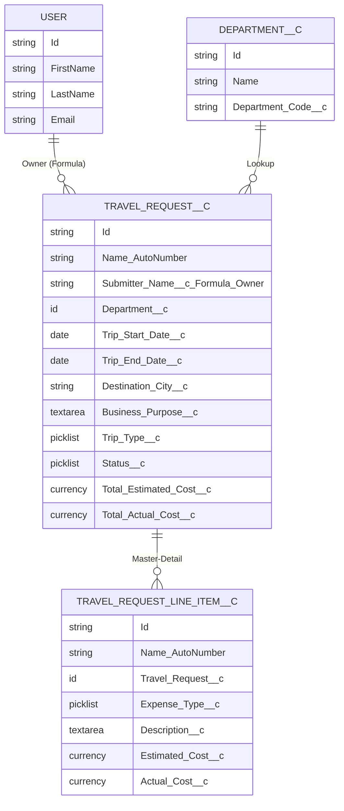
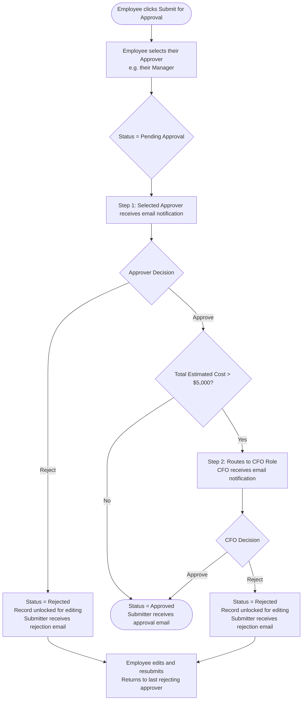

# ✈️ Travel Request App

**Salesforce Application Design Plan** | Version 1.2 (As-Built) | Generated: July 2026 by Brian Murphy, Distinguished Solution Engineer, Salesforce using Agentforce Vibes 
**From Prompt to App in 2 Hours**  Original Prompt: "I am building a Travel Request application for my company that will run on Salesforce.  Basically employees will create travel requests, enter the details for their trip such as flight cost, hotel costs, food costs and rental car costs.  The user will submit the request for approval and if it's over 5,000.00 it requires a second approval.  Can you interview me and ask me questions for how to approach configuring this new Salesforce app."

   
  

---

## Table of Contents

1. [Application Overview](#1-application-overview)
2. [Data Model & Entity Relationship Diagram](#2-data-model--entity-relationship-diagram)
3. [Department\_\_c Object](#3-department__c-object)
4. [Travel\_Request\_\_c Object](#4-travel_request__c-object)
5. [Travel\_Request\_Line\_Item\_\_c Object](#5-travel_request_line_item__c-object)
6. [Approval Process](#6-approval-process)
7. [Security Model](#7-security-model)
8. [Permission Sets](#8-permission-sets)
9. [Lightning App & Navigation](#9-lightning-app--navigation)
10. [Reports & Dashboards](#10-reports--dashboards)
11. [Build Order](#11-build-order)
12. [Lightning Record Pages](#12-lightning-record-pages)
13. [Sample Data](#13-sample-data)
14. [Post-Deployment Checklist](#14-post-deployment-checklist)

---

> [!NOTE]
> **✅ As-Built Status — Deployed July 2026**
>
> All metadata below reflects the *deployed state* to org `b.murphy@cursor.training` (Org ID: `00DKa00000ef7AfMAI`). Key implementation notes:
> - **Sharing Model:** `Travel_Request__c` and `Department__c` deployed with object-level `sharingModel=ReadWrite`. The intended OWD (Private / Public Read Only per Section 7) must be configured separately in **Setup → Security → Sharing Settings**.
> - **Approval Process:** Currently **inactive**. Step 2 CFO approver is configured as adhoc — requires manual queue creation and activation before use (see Section 14).
> - **Lightning Record Pages:** Deployed to org but not yet assigned as org defaults — requires manual activation per object (see Section 14).
> - **Permission Sets:** All three permission sets deployed and assigned to `b.murphy@cursor.training`.
> - **Sample Data:** 10 Departments, 10 initial Travel Requests (46 line items), plus **500 additional Travel Requests (1,900 line items)** loaded into the org. Records span 18 months of dates with varying users, departments, destinations, statuses, and costs.
> - **Reports:** All 5 reports deployed to the `Travel Request Reports` folder. Field references use `CustomEntity$Travel_Request__c` report type with dot-notation column names (`Travel_Request__c.FieldName`) and `CUST_NAME` for the Name field.
> - **Submitter Name Formula:** `Submitter_Name__c` updated to use `Owner:User.FirstName & " " & Owner:User.LastName` (was `CreatedBy`) — enables bulk-loaded records to show different submitter names by varying `OwnerId`.
> - **Dashboard:** `Travel Request Overview` dashboard deployed to the `Travel Request Dashboards` folder with 5 components (Spend by Department, Requests by Employee, Pending Approvals metric, Estimated vs. Actual Cost, Cost Trends Over Time).

---

## 1. Application Overview

| Attribute | Value |
|-----------|-------|
| Application Name | **Travel Request App** |
| Platform | Salesforce Lightning Experience |
| User Base | ~20 employees (all departments) |
| Primary Use Case | Employees submit travel requests for approval; costs tracked per expense line item |
| Approval Threshold | Requests with Total Estimated Cost > $5,000 require a second approval from the CFO role |
| OWD (Org-Wide Default) | Private — employees see only their own records |
| Role Hierarchy Sharing | Enabled — managers see all subordinates' requests |
| Attachments | Employees can attach documents (quotes, itineraries, receipts) to the Travel Request |

---

## 2. Data Model & Entity Relationship Diagram

> [!NOTE]
> **Relationship Summary:**
> - **User → Travel\_Request\_\_c:** `OwnerId` relationship. The `Submitter_Name__c` formula field reads `Owner:User.FirstName & " " & Owner:User.LastName` — read-only, no manual selection needed.
> - **Department\_\_c → Travel\_Request\_\_c:** Lookup relationship. Many requests can reference one department. Employee selects via lookup search.
> - **Travel\_Request\_\_c → Travel\_Request\_Line\_Item\_\_c:** Master-Detail. Line items are owned by the parent request. Deleting a Travel Request cascades and deletes all child line items. Roll-Up Summary fields aggregate line item costs to the parent.

---

## 3. Department\_\_c Object

| Field Label | API Name | Type | Notes |
|-------------|----------|------|-------|
| Department Name | Name | Text (Standard Name Field) | ⚠️ Required — e.g., "Finance", "Engineering" |
| Department Code | Department_Code__c | Text(3) | 3-letter department code (e.g., FIN, ENG, MKT, HRD) |

> [!NOTE]
> Employees select their department via a **Lookup** from the Travel Request. An admin maintains the Department list — employees do not create new departments.

---

## 4. Travel\_Request\_\_c Object

| Field Label | API Name | Type | Notes |
|-------------|----------|------|-------|
| Travel Request Name | Name | Auto-Number | Format: `TR-{0000}` (e.g., TR-0001) |
| Submitter Name | Submitter_Name__c | Formula (Text) | `Owner:User.FirstName & " " & Owner:User.LastName` — auto-populated from record owner, read-only |
| Department | Department__c | Lookup → Department\_\_c | Employee selects their department |
| Trip Start Date | Trip_Start_Date__c | Date | ⚠️ Required |
| Trip End Date | Trip_End_Date__c | Date | ⚠️ Required — Validated: cannot be before Trip Start Date |
| Destination City | Destination_City__c | Text(100) | Primary city of travel |
| Business Purpose | Business_Purpose__c | Long Text Area | Free-text justification for the trip |
| Trip Type | Trip_Type__c | Picklist | Domestic, International |
| Status | Status__c | Picklist | Draft → Submitted → Pending Approval → Approved / Rejected |
| Total Estimated Cost | Total_Estimated_Cost__c | Roll-Up Summary | SUM of `Estimated_Cost__c` from child line items. Drives the $5,000 approval threshold. |
| Total Actual Cost | Total_Actual_Cost__c | Roll-Up Summary | SUM of `Actual_Cost__c` from child line items. Used for post-trip variance reporting. |

### Validation Rule

| Rule Name | Error Condition Formula | Error Message | Field |
|-----------|------------------------|---------------|-------|
| End_Date_Before_Start_Date | `Trip_End_Date__c < Trip_Start_Date__c` | "Trip End Date cannot be before Trip Start Date." | Trip_End_Date__c |

---

## 5. Travel\_Request\_Line\_Item\_\_c Object

> [!NOTE]
> **Relationship:** Master-Detail → Travel\_Request\_\_c. Displayed as a related list on the Travel Request record page. Deleting a Travel Request cascades and deletes all its line items.

| Field Label | API Name | Type | Notes |
|-------------|----------|------|-------|
| Line Item Name | Name | Auto-Number | Format: `LI-{0000}` |
| Travel Request | Travel_Request__c | Master-Detail → Travel\_Request\_\_c | |
| Expense Type | Expense_Type__c | Picklist | Airfare, Hotel, Food, Ground Transportation, Conference Fees, Parking, Miscellaneous |
| Description | Description__c | Long Text Area | Details of the specific expense (e.g., "United Airlines SFO-JFK round trip") |
| Estimated Cost | Estimated_Cost__c | Currency | Pre-trip estimated amount for this line item |
| Actual Cost | Actual_Cost__c | Currency | Post-trip actual amount spent. Used for variance analysis vs. estimate. |

---

## 6. Approval Process

The approval process is triggered when the employee clicks **"Submit for Approval"** on a Travel Request record.

### Approval Flow

### Approval Process Configuration

| Setting | Value |
|---------|-------|
| Process Name | Travel_Request_Approval |
| Object | Travel\_Request\_\_c |
| Entry Criteria | Status\_\_c = "Submitted" |
| Record Editability | Only the administrator can edit the record (locked during approval) |
| Submission Action | Set Status\_\_c = "Pending Approval" |
| Rejection Action (any step) | Set Status\_\_c = "Rejected"; unlock record; send email to submitter |
| Final Approval Action | Set Status\_\_c = "Approved"; send email to submitter |
| Recall Action | Set Status\_\_c = "Draft"; unlock record |

### Approval Steps

| Step | Name | Criteria | Approver | Email Template |
|------|------|----------|----------|----------------|
| Step 1 | Manager Approval | Always (no criteria — applies to all submissions) | User-selected approver at submission time (e.g., employee's manager) | Travel Request Pending Approval |
| Step 2 | CFO Approval | `Total_Estimated_Cost__c > 5000` | User(s) with the **CFO** role | Travel Request Pending CFO Approval |

### Resubmission Behavior

> [!NOTE]
> When a request is **rejected**, the record is unlocked and the submitter receives an email. Upon resubmission, the request routes back to the **approver who last rejected it** — it does not restart from Step 1. This applies whether rejection came from the manager (Step 1) or the CFO (Step 2).

### Email Notifications

| Event | Recipient | Template Name |
|-------|-----------|---------------|
| Request submitted (Step 1) | Selected approver (manager) | Travel_Request_Pending_Approval |
| Request escalated (Step 2) | CFO role user(s) | Travel_Request_Pending_CFO_Approval |
| Request rejected | Submitter | Travel_Request_Rejected |
| Request approved (final) | Submitter | Travel_Request_Approved |

### Workflow Field Updates

Three Workflow Rules are deployed on `Travel_Request__c` to drive status field transitions:

| Workflow Rule Name | Trigger | Field Updated | New Value |
|-------------------|---------|---------------|-----------|
| Set_Status_Pending_Approval | Approval submission action | Status\_\_c | Pending Approval |
| Set_Status_Approved | Final approval action | Status\_\_c | Approved |
| Set_Status_Rejected | Rejection action (any step) | Status\_\_c | Rejected |

> [!NOTE]
> These workflow field updates are defined in `force-app/main/default/workflows/Travel_Request__c.workflow-meta.xml`. They work alongside the Approval Process — the Approval Process triggers the action, and the workflow field update performs the actual status change.

---

## 7. Security Model

### Org-Wide Defaults

| Object | OWD Setting | Rationale |
|--------|-------------|-----------|
| Travel\_Request\_\_c | **Private** | Employees see only their own records by default |
| Travel\_Request\_Line\_Item\_\_c | Controlled by Parent | Master-Detail — inherits parent request visibility |
| Department\_\_c | **Public Read Only** | All employees need to read department records for the lookup |

### Record Access by Role

| User Type | Record Visibility | Mechanism |
|-----------|------------------|-----------|
| Standard Employee | Own records only | OWD = Private |
| Manager | Own records + all direct reports' records | Role Hierarchy (Grant Access Using Hierarchies = enabled) |
| Finance / Admin | All records across all employees | View All permission on Travel\_Request\_\_c via Permission Set |
| CFO | All records + approval access | View All permission on Travel\_Request\_\_c via Permission Set + CFO Role |

---

## 8. Permission Sets

| Permission Set | Assigned To | Object Permissions | Special Permissions |
|----------------|------------|-------------------|---------------------|
| **Travel_Request_Employee** | All employees | Travel\_Request\_\_c: Create, Read, Edit (own); Travel\_Request\_Line\_Item\_\_c: Create, Read, Edit, Delete; Department\_\_c: Read | Submit for Approval action visible |
| **Travel_Request_Manager** | Managers | Travel\_Request\_\_c: Read (all in hierarchy), Edit; Travel\_Request\_Line\_Item\_\_c: Read, Edit; Department\_\_c: Read | Approve/Reject action; view subordinate records via role hierarchy |
| **Travel_Request_Finance** | Finance team, Admin, CFO | Travel\_Request\_\_c: Read All, Edit All; Travel\_Request\_Line\_Item\_\_c: Read All; Department\_\_c: Create, Read, Edit, Delete | View All on Travel Request; Modify All on Departments; run all reports |

---

## 9. Lightning App & Navigation

| Setting | Value |
|---------|-------|
| App Name | **Travel Request App** |
| App Type | Lightning App (Lightning Experience) |
| Developer Name | Travel_Request_App |
| Description | Application for submitting and managing employee travel requests |

### Navigation Tabs

| Tab | Object / Target | Notes |
|-----|----------------|-------|
| Travel Requests | Travel\_Request\_\_c | Primary object — default landing tab |
| Departments | Department\_\_c | Admin-maintained lookup list |
| Reports | Reports folder | Travel Request reports |
| Dashboards | Dashboards folder | Travel Request dashboard |

---

## 10. Reports & Dashboards

### Reports

| # | Report Name | Type | Object(s) | Description |
|---|-------------|------|-----------|-------------|
| 1 | Total Travel Spend by Department | Summary | Travel\_Request\_\_c | SUM of Total Estimated Cost and Total Actual Cost grouped by Department |
| 2 | Requests Pending Approval | Tabular | Travel\_Request\_\_c | Filtered to Status = "Pending Approval". Shows submitter, destination, total estimated cost, submission date |
| 3 | Estimated vs. Actual Cost by Trip | Summary | Travel\_Request\_\_c | Side-by-side comparison of Total Estimated Cost vs. Total Actual Cost per Travel Request |
| 4 | Travel Requests by Employee | Summary | Travel\_Request\_\_c | All requests grouped by Submitter Name. Shows count and total estimated cost per employee |
| 5 | Travel Cost Trends Over Time | Summary | Travel\_Request\_\_c | Monthly/quarterly spend trend grouped by Trip Start Date. Drives the trend line chart on the dashboard |

### Dashboard: Travel Request Overview

| Component | Chart Type | Source Report |
|-----------|-----------|---------------|
| Spend by Department | Horizontal Bar Chart | Total Travel Spend by Department |
| Requests Pending Approval | Metric / Count | Requests Pending Approval |
| Estimated vs. Actual Cost | Grouped Bar Chart | Estimated vs. Actual Cost by Trip |
| Requests by Employee | Donut Chart | Travel Requests by Employee |
| Cost Trends Over Time | Line Chart | Travel Cost Trends Over Time |

---

## 11. Build Order (Dependency-Safe Sequence)

> [!NOTE]
> Metadata must be deployed in this order to satisfy object relationships and field dependencies.

| Step | Metadata Type | Records | Dependency |
|------|--------------|---------|------------|
| 1 | Custom Object | Department\_\_c | None — standalone object |
| 2 | Custom Object + Fields | Travel\_Request\_\_c (all fields except Roll-Ups) | Requires Department\_\_c to exist for Lookup field |
| 3 | Validation Rule | End_Date_Before_Start_Date on Travel\_Request\_\_c | Requires Trip\_Start\_Date\_\_c and Trip\_End\_Date\_\_c fields |
| 4 | Custom Object + Fields | Travel\_Request\_Line\_Item\_\_c | Requires Travel\_Request\_\_c to exist for Master-Detail field |
| 5 | Roll-Up Summary Fields | Total\_Estimated\_Cost\_\_c, Total\_Actual\_Cost\_\_c on Travel\_Request\_\_c | Requires Travel\_Request\_Line\_Item\_\_c with Estimated\_Cost\_\_c and Actual\_Cost\_\_c fields |
| 6 | Permission Sets | Travel\_Request\_Employee, Travel\_Request\_Manager, Travel\_Request\_Finance | Requires all objects and fields to exist |
| 7 | Page Layouts | Travel\_Request\_\_c layout, Travel\_Request\_Line\_Item\_\_c layout | Requires all fields |
| 8 | Custom Tabs | Travel\_Request\_\_c tab, Department\_\_c tab | Requires objects |
| 9 | Lightning App | Travel\_Request\_App | Requires tabs |
| 10 | Approval Process | Travel\_Request\_Approval (2-step) | Requires Status\_\_c picklist, Total\_Estimated\_Cost\_\_c Roll-Up, email templates |
| 11 | Reports & Dashboards | 5 reports + Travel Request Overview dashboard | Requires all objects, fields, and data |
| 12 | Lightning Record Pages (FlexiPages) | Travel\_Request\_Record\_Page, Travel\_Request\_Line\_Item\_Record\_Page, Department\_Record\_Page | Requires all objects and fields; deployed via `sf project deploy start` |

> [!NOTE]
> Steps 1–12 were completed and deployed to `b.murphy@cursor.training` in July 2026. Step 11 (Reports & Dashboards) was deployed via metadata — see implementation notes in the As-Built Status section above. The OWD/Role Hierarchy/Approval Process configuration remain as manual post-deployment tasks — see Section 14.

---

## 12. Lightning Record Pages

Three Lightning Record Pages were generated using the Salesforce CLI template command and deployed to the org. All pages use the `flexipage:recordHomeTemplateDesktop` template.

### 12.1 Travel\_Request\_Record\_Page

| Setting | Value |
|---------|-------|
| File | `force-app/main/default/flexipages/Travel_Request_Record_Page.flexipage-meta.xml` |
| Object | Travel\_Request\_\_c |
| Template | flexipage:recordHomeTemplateDesktop |
| Org ID (FlexiPage) | 0M0Ka000000nxnVKAQ |

**Header — Dynamic Highlights**

| Slot | Fields |
|------|--------|
| Primary Field | Name (Auto-Number: TR-XXXX) |
| Secondary Fields | Status\_\_c, Trip\_Type\_\_c, Destination\_City\_\_c, Department\_\_c, Trip\_Start\_Date\_\_c, Trip\_End\_Date\_\_c |
| Actions | Edit, Delete (numVisibleActions=3) |

**Main Region — Detail Tab (default active)**

| Column | Fields (top to bottom) |
|--------|----------------------|
| Column 1 | Name, Status\_\_c, Trip\_Type\_\_c, Destination\_City\_\_c, Department\_\_c, Trip\_Start\_Date\_\_c |
| Column 2 | Trip\_End\_Date\_\_c, Submitter\_Name\_\_c, Business\_Purpose\_\_c, Total\_Estimated\_Cost\_\_c, Total\_Actual\_Cost\_\_c |

**Main Region — Related Lists Tab:** All related lists including Travel Request Line Items via `force:relatedListContainer` (10 rows, action bar visible).

**Sidebar:** Activity panel — `runtime_sales_activities:activityPanel`.

---

### 12.2 Travel\_Request\_Line\_Item\_Record\_Page

| Setting | Value |
|---------|-------|
| File | `force-app/main/default/flexipages/Travel_Request_Line_Item_Record_Page.flexipage-meta.xml` |
| Object | Travel\_Request\_Line\_Item\_\_c |
| Template | flexipage:recordHomeTemplateDesktop |
| Org ID (FlexiPage) | 0M0Ka000000nxnUKAQ |

**Header — Dynamic Highlights**

| Slot | Fields |
|------|--------|
| Primary Field | Name (Auto-Number: LI-XXXX) |
| Secondary Fields | Travel\_Request\_\_c, Expense\_Type\_\_c, Estimated\_Cost\_\_c, Actual\_Cost\_\_c |
| Actions | Edit, Delete (numVisibleActions=3) |

**Main Region — Detail Tab (default active)**

| Column | Fields (top to bottom) |
|--------|----------------------|
| Column 1 | Name, Travel\_Request\_\_c, Expense\_Type\_\_c |
| Column 2 | Estimated\_Cost\_\_c, Actual\_Cost\_\_c, Description\_\_c |

---

### 12.3 Department\_Record\_Page

| Setting | Value |
|---------|-------|
| File | `force-app/main/default/flexipages/Department_Record_Page.flexipage-meta.xml` |
| Object | Department\_\_c |
| Template | flexipage:recordHomeTemplateDesktop |
| Org ID (FlexiPage) | 0M0Ka000000nxnTKAQ |

**Header — Dynamic Highlights**

| Slot | Fields |
|------|--------|
| Primary Field | Name (Department Name) |
| Secondary Fields | Department\_Code\_\_c |
| Actions | Edit, Delete (numVisibleActions=3) |

**Main Region — Detail Tab (default active)**

| Column | Fields |
|--------|--------|
| Column 1 | Name |
| Column 2 | Department\_Code\_\_c |

**Main Region — Related Lists Tab:** All related lists including Travel Requests (via Department\_\_c Lookup on Travel\_Request\_\_c).

> [!WARNING]
> All three pages are deployed to the org but are **not yet assigned** as org defaults. See Section 14 (Step 4) for activation instructions.

---

## 13. Sample Data

Sample data was loaded into `b.murphy@cursor.training` via Anonymous Apex scripts in `scripts/apex/`.

### Departments (10 records)

Script: `scripts/apex/create_sample_departments.apex`

| # | Department Name | Department Code |
|---|----------------|-----------------|
| 1 | Finance | FIN |
| 2 | Engineering | ENG |
| 3 | Marketing | MKT |
| 4 | Human Resources | HRD |
| 5 | Operations | OPS |
| 6 | Sales | SAL |
| 7 | Legal | LEG |
| 8 | Information Technology | ITE |
| 9 | Product | PRD |
| 10 | Executive | EXE |

### Travel Requests (10 records, 46 Line Items)

Script: `scripts/apex/create_sample_travel_requests.apex`

| Record | Department | Destination | Trip Type | Status | Line Items |
|--------|-----------|-------------|-----------|--------|-----------|
| TR-0001 | Sales | New York, NY | Domestic | Approved | 5 (Airfare, Hotel, Food, Ground Transportation, Parking) |
| TR-0002 | Engineering | San Francisco, CA | Domestic | Submitted | 4 (Airfare, Hotel, Food, Conference Fees) |
| TR-0003 | Marketing | London, UK | International | Pending Approval | 5 (Airfare, Hotel, Food, Ground Transportation, Conference Fees) |
| TR-0004 | Finance | Chicago, IL | Domestic | Approved | 4 (Airfare, Hotel, Food, Miscellaneous) |
| TR-0005 | Product | Austin, TX | Domestic | Draft | 5 (Airfare, Hotel, Food, Ground Transportation, Conference Fees) |
| TR-0006 | Executive | Tokyo, Japan | International | Pending Approval | 5 (Airfare, Hotel, Food, Ground Transportation, Miscellaneous) |
| TR-0007 | Human Resources | Atlanta, GA | Domestic | Rejected | 4 (Airfare, Hotel, Food, Parking) |
| TR-0008 | Operations | Seattle, WA | Domestic | Submitted | 5 (Airfare, Hotel, Food, Ground Transportation, Conference Fees) |
| TR-0009 | Legal | Paris, France | International | Approved | 5 (Airfare, Hotel, Food, Ground Transportation, Conference Fees) |
| TR-0010 | Information Technology | Las Vegas, NV | Domestic | Draft | 4 (Airfare, Hotel, Conference Fees, Miscellaneous) |

> [!NOTE]
> **Total line items:** 46 records covering all 7 expense types.
### Bulk Sample Data (500 Travel Requests, 1,900 Line Items)

Script: `scripts/apex/create_500_travel_requests.apex`

This script populates the org with realistic bulk data for meaningful reports and dashboard visuals.

| Attribute | Details |
|-----------|---------|
| Travel Requests inserted | 500 |
| Line Items inserted | 1,900 (avg 3.8 per request) |
| Date range | 18 months: ~12 months past to ~6 months future from run date |
| Trip type mix | ~70% Domestic, ~30% International |
| Departments | All 10 departments, evenly distributed |
| Destinations | 20 US cities + 15 international cities |
| Submitters | Multiple active org users assigned via OwnerId; Submitter_Name__c formula reads Owner:User name |
| Status distribution | ~65% Approved (past-dated), ~15% Submitted, ~12% Pending Approval, ~5% Draft, ~3% Rejected |
| Actual costs | Populated only on Approved past-dated records with plus or minus 20-25% variance from estimated |
| Expense types | Airfare, Hotel, Food, Ground Transportation, Conference Fees, Parking, Miscellaneous |

> [!NOTE]
> The `Submitter_Name__c` formula was updated from `CreatedBy` to `Owner:User` to support varying submitter names in bulk-loaded data. Setting `OwnerId` on each record at insert time drives the submitter name shown on records and reports.

 Each line item includes both `Estimated_Cost__c` and `Actual_Cost__c` to enable variance analysis via the Roll-Up Summary fields and reports.

---

## 14. Post-Deployment Checklist

The following tasks require manual configuration in Salesforce Setup after metadata deployment.

### 1️⃣ Sharing Settings (OWD)

> [!WARNING]
> Required before go-live — current OWD is not enforcing the designed security model.

| Step | Action |
|------|--------|
| 1 | Go to **Setup → Security → Sharing Settings** |
| 2 | Set `Travel_Request__c` OWD to **Private** |
| 3 | Set `Department__c` OWD to **Public Read Only** |
| 4 | Confirm `Travel_Request_Line_Item__c` is **Controlled by Parent** |
| 5 | Enable **Grant Access Using Hierarchies** for Travel\_Request\_\_c |
| 6 | Save and recalculate sharing |

### 2️⃣ Role Hierarchy

| Step | Action |
|------|--------|
| 1 | Go to **Setup → Users → Roles** |
| 2 | Create role: **CEO** (top of hierarchy) |
| 3 | Create role: **CFO** (reports to CEO) |
| 4 | Create role: **Manager** (reports to CFO or CEO as appropriate) |
| 5 | Create role: **Employee** (reports to Manager) |
| 6 | Assign users to their appropriate roles |

### 3️⃣ CFO Approvals Queue & Approval Process Activation

> [!WARNING]
> Required before the Approval Process can be used — the process is currently inactive and Step 2 has no queue configured.

| Step | Action |
|------|--------|
| 1 | Go to **Setup → Queues** → click **New** |
| 2 | Set Label: `CFO Approvals`, Queue Name: `CFO_Approvals` |
| 3 | Add **Travel\_Request\_\_c** to Supported Objects |
| 4 | Add the CFO user to Queue Members → Save |
| 5 | Go to **Setup → Approval Processes → Travel\_Request\_\_c → Travel\_Request\_Approval** |
| 6 | Click **Step 2 (CFO Approval)** → Edit |
| 7 | Change approver type to **Queue** → select `CFO Approvals` → Save |
| 8 | Return to the approval process list → click **Activate** next to `Travel_Request_Approval` |

> [!NOTE]
> **Alternative:** Instead of a queue, change the approver type to **Specific User** and select the CFO user directly in Steps 6–7.

### 4️⃣ Assign Lightning Record Pages as Org Defaults

| Object | Steps |
|--------|-------|
| Travel\_Request\_\_c | Open any Travel Request record → gear icon → **Edit Page** → **Activation** → **Assign as Org Default** → Save & Activate |
| Travel\_Request\_Line\_Item\_\_c | Open any Line Item record → gear icon → **Edit Page** → **Activation** → **Assign as Org Default** → Save & Activate |
| Department\_\_c | Open any Department record → gear icon → **Edit Page** → **Activation** → **Assign as Org Default** → Save & Activate |

> [!NOTE]
> Alternatively, go to **Setup → Lightning App Builder**, find each FlexiPage, and use the Activation menu from there.

### 5️⃣ Assign Permission Sets to All Users

| Permission Set | Assign To |
|----------------|-----------|
| Travel_Request_Employee | All users who will submit travel requests |
| Travel_Request_Manager | All managers who will approve requests |
| Travel_Request_Finance | Finance team members, system admin, CFO |

Use: `sf org assign permset --name <PermSetName> --on-behalf-of <username>`

### 6️⃣ ✅ Reports & Dashboard — Deployed via Metadata

> [!NOTE]
> Reports and the dashboard have been deployed via `sf project deploy start`. No manual build required.

| Item | Status | Details |
|------|--------|---------|
| Travel Request Reports folder | ✅ Deployed | `force-app/main/default/reports/Travel_Request_Reports-meta.xml` |
| 5 Reports | ✅ Deployed | `force-app/main/default/reports/Travel_Request_Reports/` |
| Travel Request Dashboards folder | ✅ Deployed | `force-app/main/default/dashboards/Travel_Request_Dashboards-meta.xml` |
| Travel Request Overview dashboard | ✅ Deployed | `force-app/main/default/dashboards/Travel_Request_Dashboards/Travel_Request_Overview.dashboard-meta.xml` |

### Checklist Summary

| ☐ | Task | Priority |
|---|------|----------|
| ☐ | Configure OWD in Sharing Settings (Private / Public Read Only) | 🔴 Critical — before go-live |
| ☐ | Build Role Hierarchy (CEO, CFO, Manager, Employee) | 🔴 Critical — before go-live |
| ☐ | Create CFO Approvals Queue and add CFO user | 🔴 Critical — before approval use |
| ☐ | Update Approval Process Step 2 to use CFO Approvals Queue | 🔴 Critical — before approval use |
| ☐ | Activate the Travel_Request_Approval approval process | 🔴 Critical — before approval use |
| ☐ | Assign Lightning Record Pages as org defaults (all 3 objects) | 🟡 High |
| ☐ | Assign permission sets to all org users | 🟡 High |
| ✅ | Deploy 5 reports to Travel Request Reports folder | ~~🟢 Medium~~ — **Done** |
| ✅ | Deploy Travel Request Overview dashboard | ~~🟢 Medium~~ — **Done** |

---

*Travel Request App — Salesforce Design Plan — Version 1.2 (As-Built) — July 2026*
